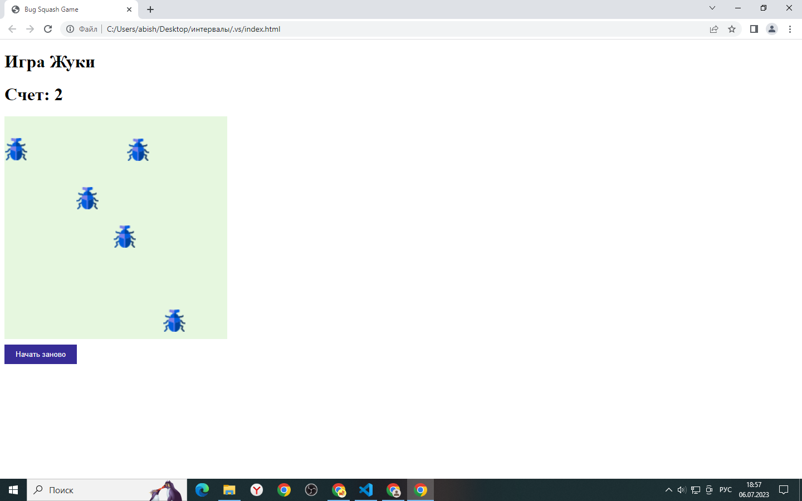

# Игра "Поймай жука"



## Описание

Catch the Bugs - это игра, в которой вам нужно ловить жуков, перемещающихся по игровому полю. Жуки перемещаются каждые 0.6 секунды в случайное место на поле, и ваша задача - кликать по ним, чтобы поймать.


## Правила

+ На игровом поле размером 400x400 пикселей случайным образом появляются жуки.
+ Игрок должен щелкнуть на жука, чтобы поймать его.
+ За каждого пойманного жука игрок получает одно очко.
+ Игра продолжается до тех пор, пока игрок не поймает всех жуков.
+ Когда все жуки пойманы, игра завершается, и выводится сообщение о завершении игры.

## Пример кода

```JavaScript
// Создание жуков
 function createBug() {
        if (bugs.length === 0) {
            for (let i = 0; i < bugsCount; i++) {
                const bug = document.createElement('div');
                bug.className = 'bug';
                bug.style.top = Math.random() * 360 + 'px';
                bug.style.left = Math.random() * 360 + 'px';
                bugs.push(bug);
                gameBoard.appendChild(bug);              
    }
```

```JavaScript
// Сброс игры
  function resetGame() {
        score = 0;
        bugsCount = 7;
        bugs = [];
        scoreDisplay.textContent = score;
        gameBoard.innerHTML = '';
```
```JavaScript
// Обработчик клика на жука
 bug.addEventListener('click', function() {
                    bug.style.display = 'none';
                    score++;
                    scoreDisplay.textContent = score;
```
## Инструкции по установке и запуску
+ Клонируйте репозиторий с игрой.
+ Откройте файл index.html в веб-браузере.
+ Играйте и наслаждайтесь!
